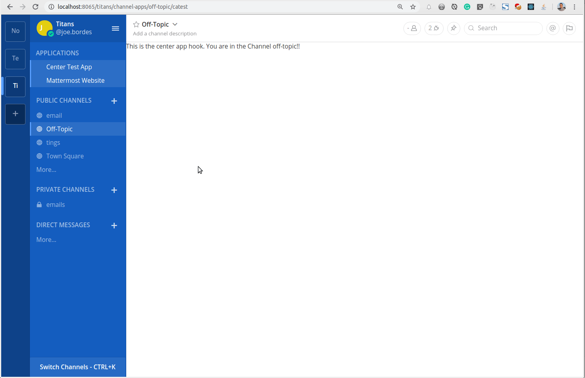

# Center Application and Application List Test ting

Center application test plugin to use central body hook and application side bar list.

This mattermost plugin is to test and demonstrate the usage of the two hooks:

- TeamAppComponent
- AppCenterComponent

**TeamAppComponent** adds links in the sidebar that can take the users anywhere they may need to access, but primiarly opens the possiblity to add a list of actions for quick reference, custom plugin applications and similar functionality.

**AppCenterComponent** adds the possiblity to load a react plugin in the center body of the mattermost client webapp so we can add any functionality we need that escapes the limitations of sending a message.

To test the **AppCenterComponent** this plugin adds a link in the sidebar that can take us to the TEAM version of the application and also a channel header button that takes us to the CHANNEL version of the application, but you can directly go to these applications with these URLs:

- {mattermosturl}/{teamname}/channel-apps/{channelname}/catest
- {mattermosturl}/{teamname}/apps/catest

Here you can see a quick demo:

